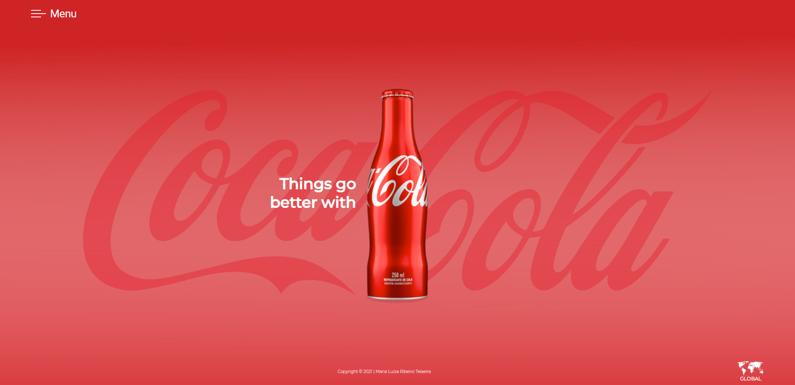
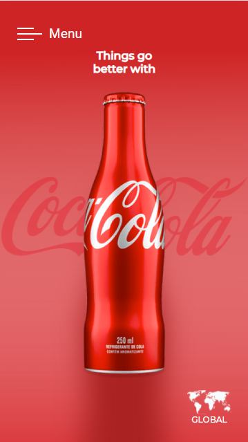

# Página Coca Cola 
Projeto criado sob orinetação do professor [Fernando Leonid](https://github.com/fernandoleonid) com o objetivo didático nas aula de Programação Web Front-End, matéria integrante do curso de Desenvolvimento de Sistema do [SENAI](https://jandira.sp.senai.br/)

O projeto consiste em uma página estática  e responsiva na qual um produto da Coca cola aparece em destaque. 

## Resultados

### Web

### Mobile

